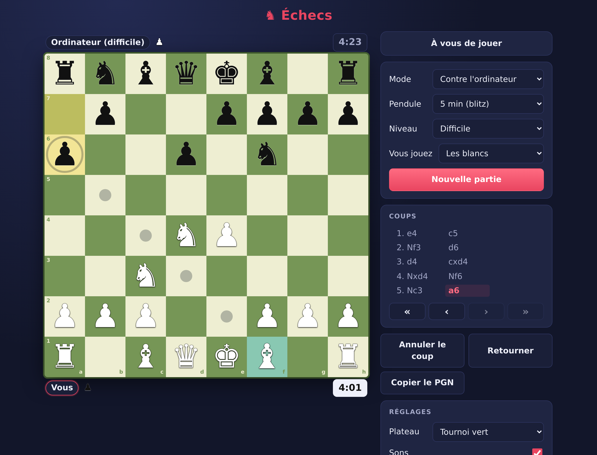
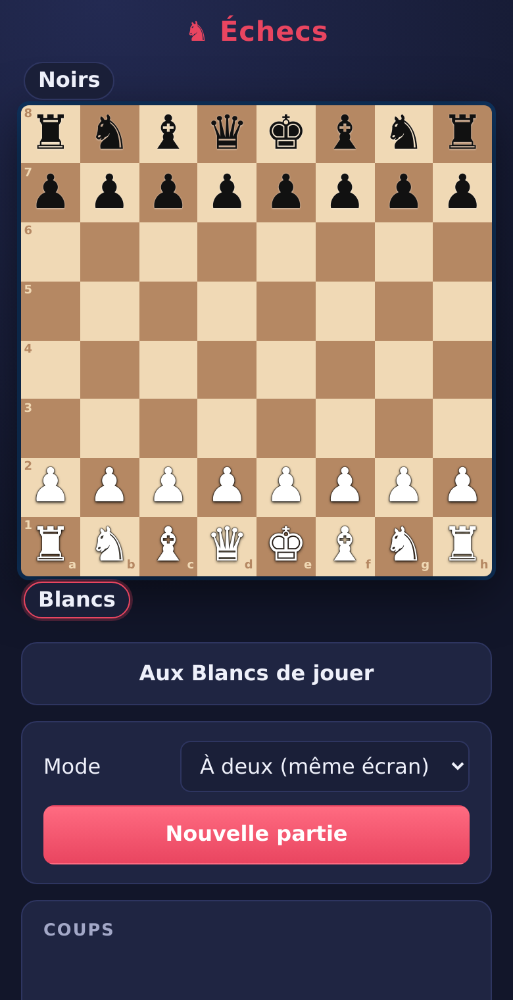
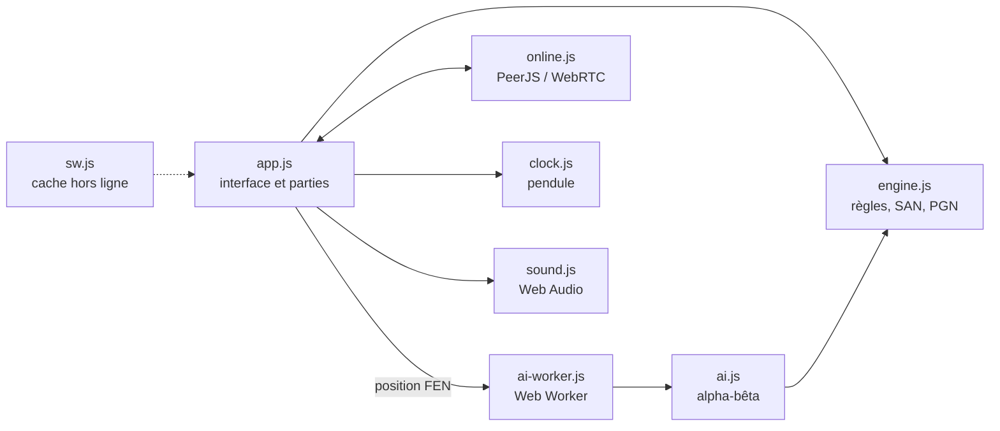
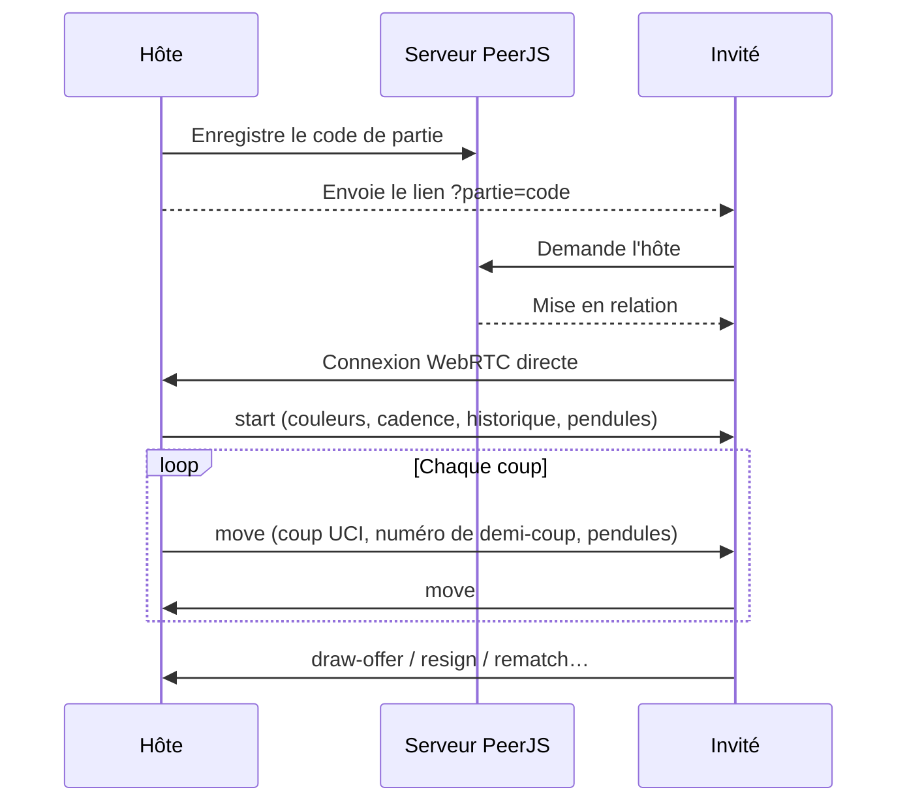

<div align="center">

# ♞ Échecs

**Un jeu d'échecs complet, rapide et installable — qui tient dans quelques fichiers statiques.**

Jouez à deux sur le même écran, défiez l'ordinateur, ou envoyez un lien à un ami
et jouez **en ligne en pair-à-pair**, sans compte ni serveur de jeu.

[](https://github.com/LaFicelleCmoi/echecs/actions/workflows/ci.yml)




</div>

---

## ✨ Pourquoi il est cool

| | |
| --- | --- |
| ♟️ **Toutes les règles, vraiment toutes** | Roque, prise en passant, promotion au choix, échec et mat, pat, triple répétition, règle des 50 coups, matériel insuffisant. |
| 🤖 **Une IA qui se défend** | Alpha-bêta, table de transposition, coups killers, extension d'échec, quiescence. Trois niveaux, calculés dans un Web Worker : l'interface ne gèle jamais. |
| ⏱️ **Pendule** | Bullet, blitz ou rapide, avec incrément. Même en ligne, synchronisée entre les deux joueurs, et l'IA gère son temps. |
| 🔁 **Revoir la partie** | Cliquez sur un coup ou utilisez `←` `→` pour rejouer la partie pas à pas, avec animation. |
| 🔊 **Sons et animations** | Les pièces glissent, claquent et avertissent en cas d'échec — sons synthétisés, aucun fichier audio. |
| 🎨 **Thèmes** | Bois classique, tournoi vert, bleu glacier ou marbre. |
| 🌍 **En ligne en un lien** | « Créer une partie » → on partage le lien → on joue. Connexion directe WebRTC entre les deux navigateurs. |
| 📱 **Partout** | Clic, glisser-déposer, tactile, clavier. Plateau qui s'adapte de l'iPhone à l'écran 4K. |
| ✈️ **Hors ligne** | Installable comme une appli (PWA). Local et contre l'IA fonctionnent sans réseau. |
| 💾 **Rien ne se perd** | La partie est sauvegardée à chaque coup et reprend après un rechargement. |
| 📜 **Pour les puristes** | Historique en notation algébrique (SAN), annulation, nulle par accord, export PGN en un clic. |
| 🔒 **Blindé** | CSP stricte, en-têtes de sécurité, et chaque coup reçu en ligne est revalidé par le moteur local. |

<div align="center">

</div>

## 🎮 Comment jouer

| Mode | Comment |
| --- | --- |
| **À deux (même écran)** | Choisissez le mode et jouez chacun votre tour. |
| **Contre l'ordinateur** | Choisissez le niveau (facile, moyen, difficile) et votre couleur (blancs, noirs ou au hasard). |
| **En ligne avec un ami** | Choisissez la pendule, cliquez sur **Créer une partie**, puis **Partager** le lien. Votre ami l'ouvre : la partie démarre. Nulle, abandon et revanche (couleurs inversées) inclus. |

### ⌨️ Raccourcis

| Touche | Action |
| --- | --- |
| `←` `→` | Coup précédent / suivant (revue de la partie) |
| `Origine` / `Fin` | Début de la partie / position actuelle |
| `←` `↑` `→` `↓` (sur le plateau) | Se déplacer de case en case |
| `Entrée` / `Espace` | Sélectionner ou jouer |
| `Échap` | Annuler la sélection |
| `Ctrl` + `Z` | Annuler le dernier coup |

## 🧠 Sous le capot



### Le jeu en ligne, sans serveur de jeu



- Le serveur PeerJS ne sert **qu'à la mise en relation** : ensuite, les coups passent
  directement d'un navigateur à l'autre.
- L'**hôte fait autorité** : il fixe les couleurs et renvoie tout l'historique en cas de
  reconnexion ou de désynchronisation.
- Un coup illégal ou hors tour est **rejeté** par le moteur local.

### L'IA

| Niveau | Profondeur | Temps max | Personnalité |
| --- | --- | --- | --- |
| Facile | 1 demi-coup | 0,3 s | Joue au feeling (beaucoup de hasard) |
| Moyen | 3 demi-coups | 1 s | Solide, un peu de variété |
| Difficile | jusqu'à 8 demi-coups | 2,5 s | Aucune pitié |

- **Recherche** : negamax alpha-bêta, approfondissement itératif, table de transposition
  (hachage de Zobrist), coups killers, extension d'échec, quiescence sur les captures.
- **Évaluation** : matériel + tables de position par pièce, avec une table spéciale pour
  le roi en finale.
- **Répétitions** : l'IA connaît l'historique de la partie — elle évite la nulle quand elle
  gagne et la cherche quand elle perd.
- **Pendule** : elle répartit son temps restant et ne perd pas au temps.
- Face à la première version, à temps égal : **9,5 / 12** (≈ +190 Elo).

### Le moteur

- Plateau à 64 cases, `makeMove` / `undo` sans copie : rapide et sans allocation inutile.
- Validé par des tests **perft** sur les positions de référence de la
  [Chess Programming Wiki](https://www.chessprogramming.org/Perft_Results)
  (jusqu'à 197 281 positions depuis la position initiale).

## 📁 Structure

```
.
├── index.html            Page unique
├── css/style.css         Styles (responsive, thème sombre)
├── js/
│   ├── engine.js         Moteur de règles
│   ├── ai.js             IA alpha-bêta
│   ├── ai-worker.js      IA dans un Web Worker
│   ├── online.js         Jeu en ligne pair-à-pair
│   ├── clock.js          Pendule avec incrément
│   ├── sound.js          Sons synthétisés (Web Audio)
│   └── app.js            Interface et logique de partie
├── sw.js                 Service worker (hors ligne)
├── manifest.webmanifest  Manifeste PWA
├── icons/                Icônes de l'application
├── vercel.json           En-têtes de sécurité et de cache
└── tests/                Tests du moteur et de l'IA
```

## 🛠️ Développement

Aucune installation : c'est du HTML, du CSS et des modules JavaScript natifs.

```bash
git clone https://github.com/LaFicelleCmoi/echecs.git
cd echecs
npm start    # http://localhost:3000
npm test     # perft + règles + IA + pendule
```

> Les modules ES et le service worker exigent un vrai serveur HTTP : ouvrir
> `index.html` directement depuis le disque ne suffit pas.

## 🚀 Déploiement

Chaque push sur `main` :

1. lance les tests dans **GitHub Actions** ;
2. est déployé automatiquement par **Vercel** (preset « Other », aucune commande de build).

Les fichiers de développement (`tests/`, `docs/`, `.github/`…) sont exclus du site via
`.vercelignore`.

## 🗺️ Idées pour la suite

- [x] Pendule (bullet, blitz, rapide)
- [x] Sons et animations des pièces
- [x] Thèmes de plateau
- [x] Revue de la partie coup par coup
- [ ] Recherche d'adversaire au hasard et classement (nécessite un backend temps réel)
- [ ] Analyse de fin de partie par l'IA
- [ ] Chat en ligne

---

<div align="center">

Fait avec ♟️ par [LaFicelleCmoi](https://github.com/LaFicelleCmoi)

</div>
